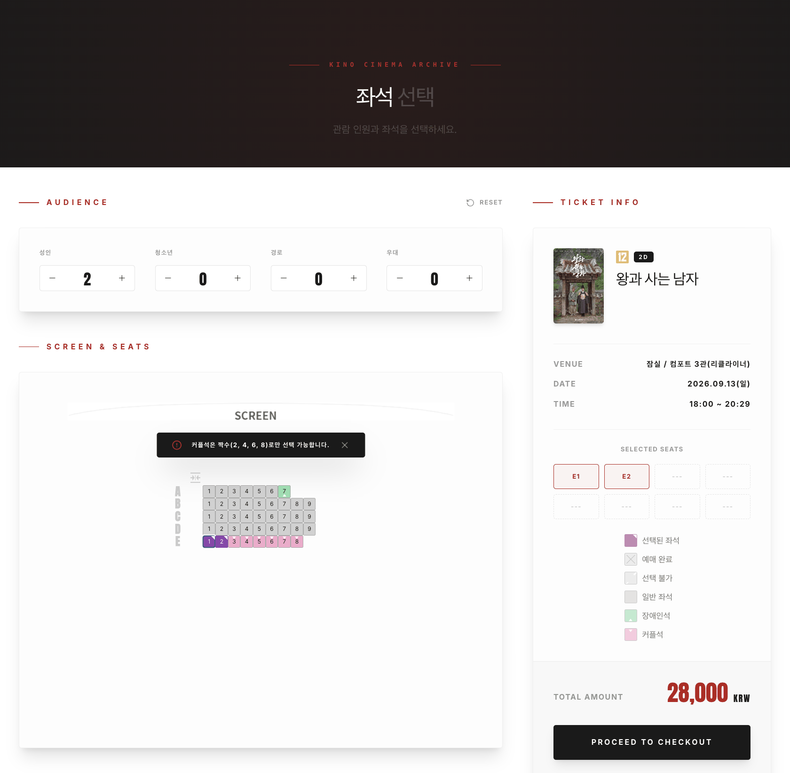
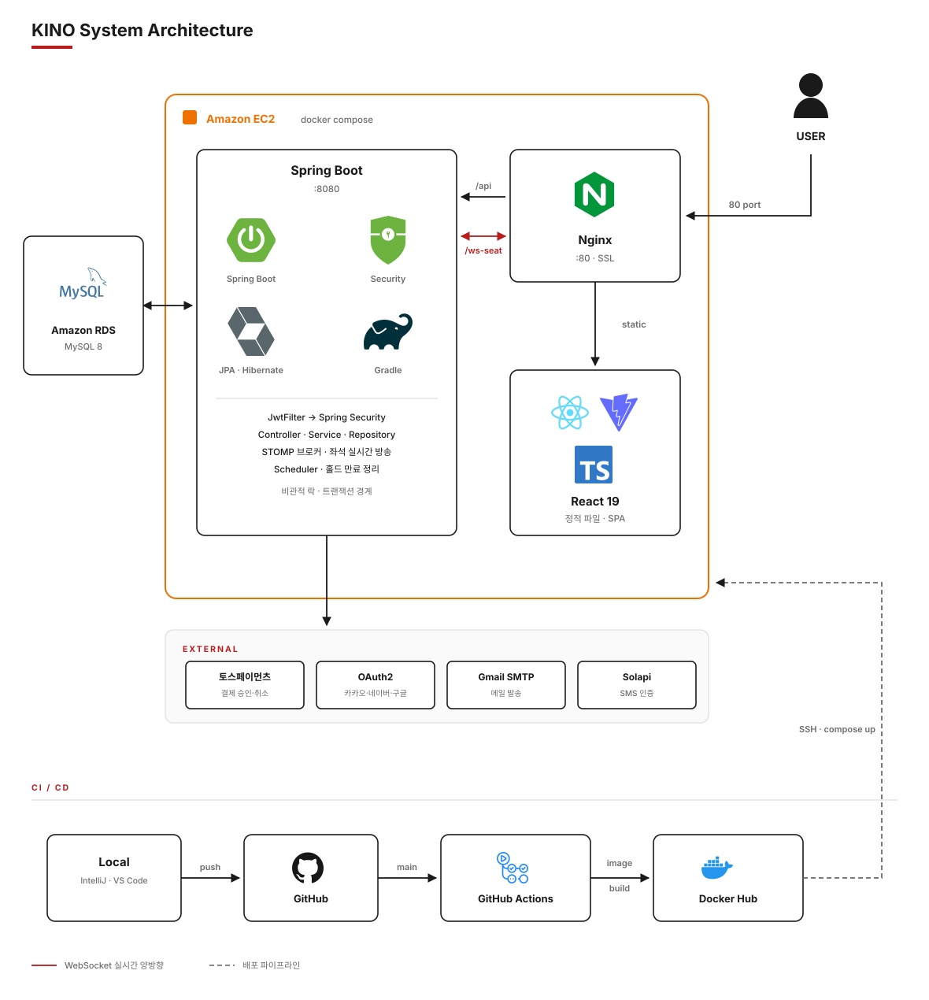

<div align="center">


### KINO

영화관 예매의 전 과정을 구현한 풀스택 프로젝트<br>
실시간 좌석 선점부터 PG 결제, 티켓 발급까지

<br>



</div>

<br>

## 이런 걸 만들었습니다

멀티플렉스 영화관의 온라인 예매 시스템을 재현했습니다. 단순 CRUD가 아니라
**여러 사람이 같은 좌석을 동시에 누르는 상황**과 **결제 도중 실패하는 상황**을
어떻게 안전하게 처리할지에 초점을 뒀습니다.

- **실시간 좌석 선점** — WebSocket으로 남이 잡은 좌석이 즉시 회색으로 바뀝니다
- **동시성 제어** — 비관적 락으로 같은 좌석 중복 예매를 차단, 10분 뒤 자동 해제
- **결제 안전장치** — 금액 위변조 검증, 멱등성 보장, 승인 후 DB 실패 시 PG 전액취소
- **회원 / 비회원 이원 인증** — JWT 기반, 카카오·네이버·구글 소셜 로그인

> [!NOTE]
> 학습용 프로젝트입니다. 결제는 토스페이먼츠 테스트 키로 동작하며 실제 결제가 발생하지 않습니다.

## 구조



## 빠른 실행

> 사전 준비 — JDK 17+ · Node 20+ · MySQL 8+

```bash
mysql -u root -p -e "CREATE DATABASE kino_db DEFAULT CHARACTER SET utf8mb4;"
mysql -u root -p kino_db < frontend/common_sql.sql
mysql -u root -p kino_db < backend/src/main/resources/sql/coupons_kino_partner_seed.sql
```

```bash
cd backend && ./gradlew bootRun            # localhost:8080
```

```bash
cd frontend && npm install && npm run dev  # localhost:5173
```

API 명세는 서버 기동 후 `localhost:8080/swagger-ui/index.html` 에서 확인할 수 있습니다.

[](https://github.com/SO0omin/KINO/wiki/로컬-개발-환경)

## 기술 스택

**Backend**


**Frontend**


**Infra**


## 문서

| 문서 | 내용 |
|:--|:--|
| [](https://github.com/SO0omin/KINO/wiki/화면) | 예매 흐름을 따라 보는 실제 화면 |
| [](https://github.com/SO0omin/KINO/wiki/아키텍처) | 시스템 구성과 요청 흐름 |
| [](https://github.com/SO0omin/KINO/wiki/도메인-모델) | ERD와 좌석·예약·결제 상태 전이 |
| [](https://github.com/SO0omin/KINO/wiki/핵심-구현) | 동시성 제어 · 결제 안전장치 · 인증 설계 |
| [](https://github.com/SO0omin/KINO/wiki/트러블슈팅) | 막혔던 문제와 해결 과정 |
| [](https://github.com/SO0omin/KINO/wiki/API) | 엔드포인트 명세 |
| [](https://github.com/SO0omin/KINO/wiki/배포) | Docker 구성과 CI/CD 파이프라인 |

## 팀

세 명이 도메인을 나눠 맡고, 경계가 닿는 화면은 함께 만들었습니다.

| 담당 | 영역 |
|:--|:--|
| **정수민** [](https://github.com/SO0omin) | 좌석 지정 예매 · 실시간 좌석 동기화 · 회원·비회원 인증 · 소셜 로그인 · 극장·상영시간표 |
| **함한솔** [](https://github.com/h-ns-l0) | 결제 및 PG 연동 · 쿠폰·포인트 · 마이페이지 전 섹션 · 예매 내역 및 취소 |
| **이류진** [](https://github.com/ryurujxx) | 예매 필터 · 영화 목록·상세 · 리뷰 · 메인 페이지 · 박스오피스 랭킹 |
